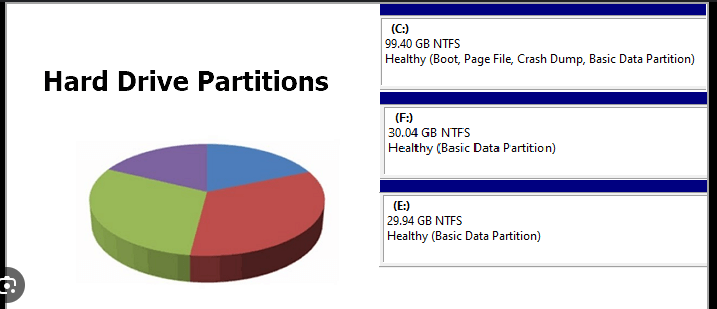
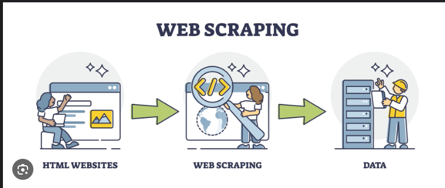

Portfolio
=========

Programming Projects
--------------------

*For access to my private project repositories, please [email me](mailto:example@csustudent.net?subject=GitHub%20Access) with the subject line, GitHub Access.

---
### [Chess Game | CSCI 325](project1)

---
### [Disk Space | CSCI 301](project2)

---
### [Chat Room | CSCI 332](project3)

---
### [Web Scraper | CSCI 301](project4)

---

Ethics Papers
-------------

### [Ethics in Cybersecurity](/pdf/Ethics in Cybersecurity (2).pdf)

-   **Class:**  CSCI 325
-   **Grade:**  B

### [Ethics in Computer Science](/pdf/Ethics in computer science (3).pdf)

-   **Class:** CSCI 301
-   **Grade:** A

### [Ethics Paper Applied Networking](/pdf/Ethics Paper Applied Networking.pdf)

-   **Class:** CSCI 325
-   **Grade:** A

---

Presentations
-------------

### [Applied Semester Project](/pdf/Applied Semster Project.pdf)

- **Class:** CSCI 325
- **Grade:** A

### [Cyber Defense](/pdf/Cyber defense.pdf)

- **Class:** Cyber Defense
- **Grade:** A

---

Page template forked from <a href="https://github.com/csu-cs/csci-portfolio">CSU-CS</a>

<!-- Remove above link if you don't want to attributive -->
