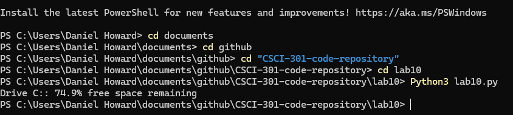

[Back to Portfolio](./)

Project 2 Title
===============

-   **Class:** CSCI 301
-   **Grade:** Python
-   **Language(s):** 
-   **Source Code Repository:** [features/mastering-markdown](https://guides.github.com/features/mastering-markdown/)  
    (Please [email me](mailto:danielhoward1@csustudent.net?subject=GitHub%20Access) to request access.)

## Project description

A program that checks the disk space available on any disk on your computer.

## How to compile and run the program

How to compile (if applicable) and run the project.

cd documents
cd github
cd CSCI-301-CODE-REPOSITORY
cd Lab10
python3 Lab10.py
```

If the programming language does not require compilation, the update the heading to be “How to run the program.” If your application is deployed on a remote service, including instructions on how to deploy it.

## UI Design

Almost every program requires user interaction, even command-line programs. Include in this section the tasks the user can complete and what the program does. You don't need to include how it works here; that information may go in the project description or in an additional section, depending on its significance.

After executing the program it will check your disk space and tell you how much is left (figure 1).

  
Fig 1. Example output after input is processed.


## 3. Additional Considerations

For more details see [GitHub Flavored Markdown](https://guides.github.com/features/mastering-markdown/).

[Back to Portfolio](./)
