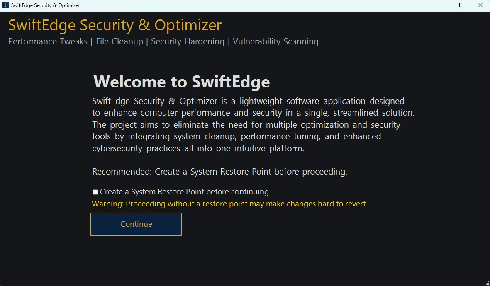
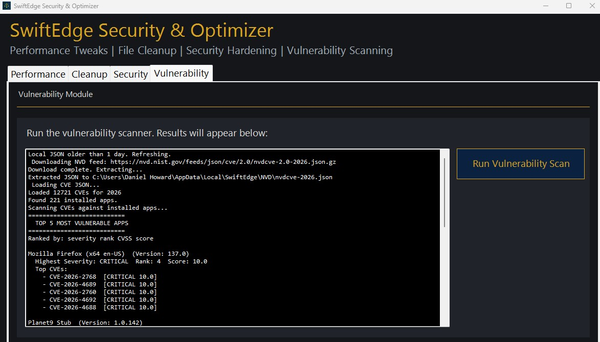

[Back to Portfolio](./)

Project 2 Title
===============

-   **Class:** CSCI 499
-   **Grade:** Ps
-   **Language(s):** 
-   **Source Code Repository:** [features/mastering-markdown](https://guides.github.com/features/mastering-markdown/)  
    (Please [email me](mailto:danielhoward1@csustudent.net?subject=GitHub%20Access) to request access.)

## Project description

A Security Program that can run a vulnerability scan, Harden, and secure your computer. Swift Edge security is a free security software for computers.

## How to run the program

No compiling needed, download the SwiftEdge folder
Go into the folder in File Explorer and click on dist
Run the executable file and hit Allow to run
```

If the programming language does not require compilation, the update the heading to be “How to run the program.” If your application is deployed on a remote service, including instructions on how to deploy it.

## UI Design

Almost every program requires user interaction, even command-line programs. Include in this section the tasks the user can complete and what the program does. You don't need to include how it works here; that information may go in the project description or in an additional section, depending on its significance.

After Entering the program decide if you want to make a restore point(figure 1).

  
Fig 1. Example output after input is processed.

Next, click on the vulnerability scan menu and click run scan


Fig 2. Vuln Scan Window.


## 3. Additional Considerations

For more details see [GitHub Flavored Markdown](https://guides.github.com/features/mastering-markdown/).

[Back to Portfolio](./)
