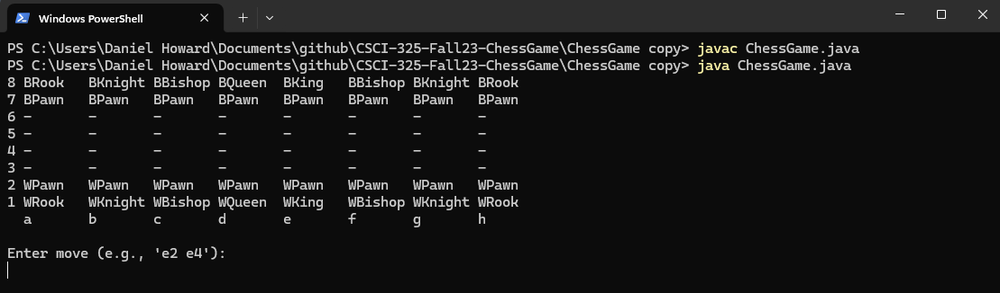
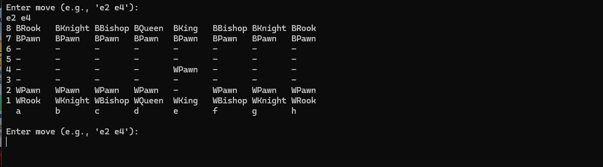
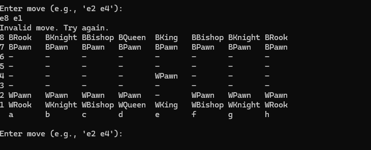

[Back to Portfolio](./)

Project 2 Title
===============

-   **Class:** CSCI 301
-   **Grade:** A
-   **Language(s):** Pearl
-   **Source Code Repository:** [features/mastering-markdown](https://guides.github.com/features/mastering-markdown/)  
    (Please [email me](mailto:example@csustudent.net?subject=GitHub%20Access) to request access.)

## Project description

A numerical guessing game

## How to compile and run the program

How to compile (if applicable) and run the project.

cd documents
cd github
cd CSCI-301-CODE-REPOSITORY
perl testone.pl
```

If the programming language does not require compilation, the update the heading to be “How to run the program.” If your application is deployed on a remote service, including instructions on how to deploy it.

## UI Design

Almost every program requires user interaction, even command-line programs. Include in this section the tasks the user can complete and what the program does. You don't need to include how it works here; that information may go in the project description or in an additional section, depending on its significance.

After Running the Program (figure 1) shows the bootup screen of the ChessGame. The user is prompted to choose a move after user chooses a move it will show you the move (figure 2). If the move is invalid the program will say choose a new move invalid see (figure 3).

  
Fig 1. The launch screen

  
Fig 2. Example output after input is processed.

  
Fig 3. Feedback when an error occurs.

## 3. Additional Considerations

For more details see [GitHub Flavored Markdown](https://guides.github.com/features/mastering-markdown/).

[Back to Portfolio](./)
