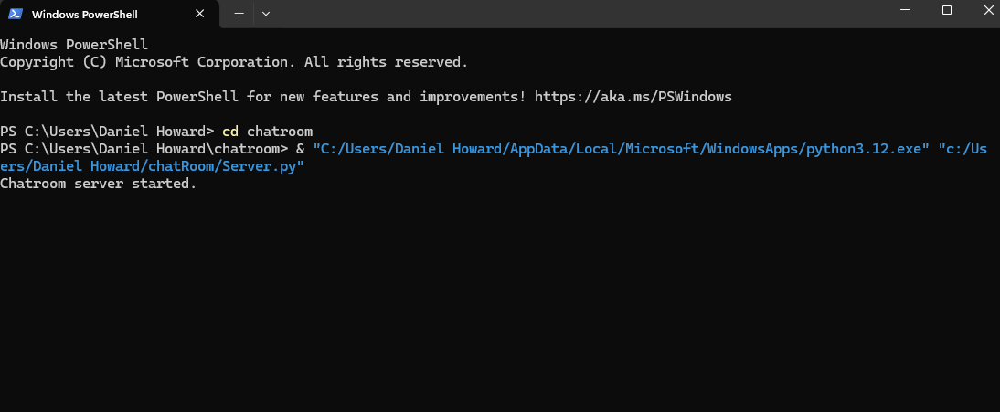
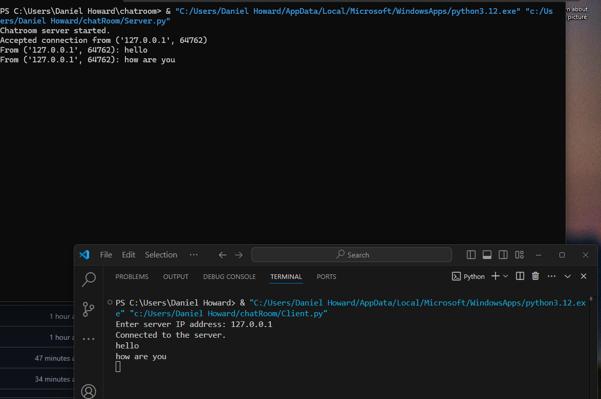

[Back to Portfolio](./)

Project 3 Title
===============

-   **Class:** CSCI 332
-   **Grade:** A
-   **Language(s):** Python
-   **Source Code Repository:** [features/mastering-markdown](https://guides.github.com/features/mastering-markdown/)  
    (Please [email me](mailto:example@csustudent.net?subject=GitHub%20Access) to request access.)

## Project description

This is a server and client chat room. It is a basic chat room between clients that can talk on the server. It is coded in Python.

## How to compile and run the program

How to compile (if applicable) and run the project.

cd ChatRoom
python3 server.py
python3 client.py
```

If the programming language does not require compilation, the update the heading to be “How to run the program.” If your application is deployed on a remote service, including instructions on how to deploy it.

## UI Design

Almost every program requires user interaction, even command-line programs. Include in this section the tasks the user can complete and what the program does. You don't need to include how it works here; that information may go in the project description or in an additional section, depending on its significance.

After starting the server side and the client side and entering the IP, it will start the chat room (figure1). Next, you will input what you want to say to the other clients in the chat room (figure2)

  
Fig 1. The launch screen

  
Fig 2. Example output after input is processed.

## 3. Additional Considerations

For more details see [GitHub Flavored Markdown](https://guides.github.com/features/mastering-markdown/).

[Back to Portfolio](./)
