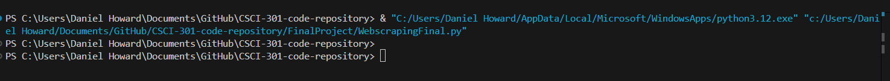
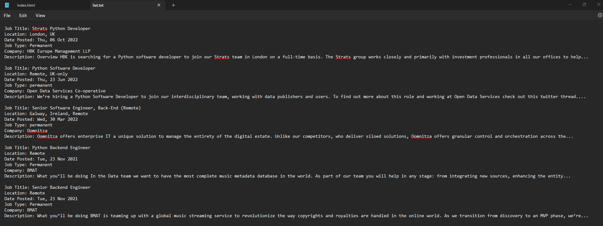

[Back to Portfolio](./)

Project 4 Title
===============

-   **Class:** CSCI 301
-   **Grade:** A
-   **Language(s):** Python
-   **Source Code Repository:** [features/mastering-markdown](https://guides.github.com/features/mastering-markdown/)  
    (Please [email me](mailto:example@csustudent.net?subject=GitHub%20Access) to request access.)

## Project description

This is a website parsing code that can pull specific information off of a given URL.

## How to compile and run the program

How to compile (if applicable) and run the project.

cd documents
cd github
cd "CSCI-301-code-repository"
cd FinalProject
python3 WebscrapingFinal.py
```

If the programming language does not require compilation, the update the heading to be “How to run the program.” If your application is deployed on a remote service, including instructions on how to deploy it.

## UI Design

Almost every program requires user interaction, even command-line programs. Include in this section the tasks the user can complete and what the program does. You don't need to include how it works here; that information may go in the project description or in an additional section, depending on its significance.

After running the code the web scraper will go to the given URL and search for the specific elements in html code (figure1). then create a file with the information separate (figure 2).

  
Fig 1. The launch screen

  
Fig 2. Feedback when an error occurs.

## 3. Additional Considerations
